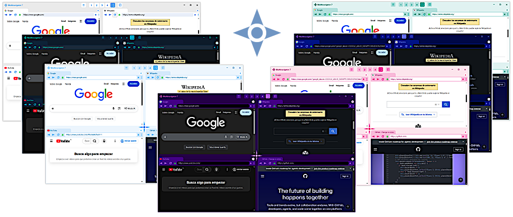
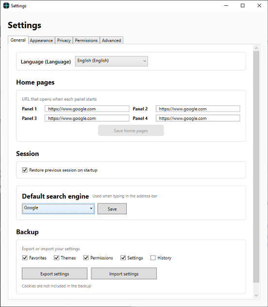
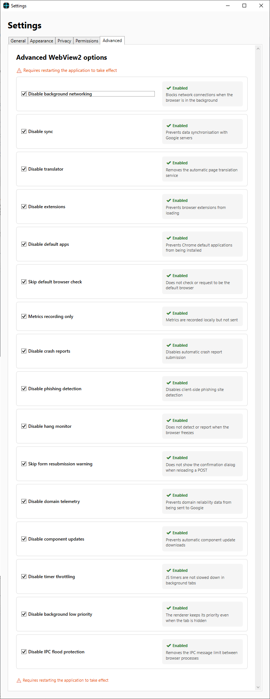
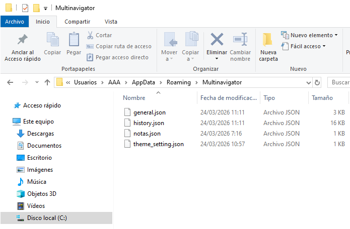

&nbsp;

<strong>English 🇺🇸</strong> |
<a href="README.es.md">Español 🇪🇸</a>

🚀 Un navegador para Windows limpio, rápido y totalmente privado. Sin anuncios. Sin rastreo. Sin concesiones. Navega x4 también en 2026.

EN · ES · ZH · HI · NL · PT · FR · DE · JA · RU · KO · TR · ID · IT · BN · VI · PL · TH · SW · TL · UK · CS · RO · MS · UR

  

📖 Historia — Edición 25 Aniversario 🎉
MultiNavigator nació en 2001, antes que Firefox o Chrome… ☕ Aún necesito un café..
En una época en la que la multitarea web no existía, presentamos cuatro navegadores independientes simultáneos con un divisor movible.

25 años después, la versión 7.0.0 es una reescritura completa desde cero — sin una sola línea del código original — manteniendo el alma única del proyecto. Obra registrada en el Registro de la Propiedad Intelectual de España.

 

🖥️ Navegación Multipanel
4 Navegadores Simultáneos y Divisor Movible
Gestiona cuatro instancias independientes en una sola ventana, optimizando tu flujo de trabajo y eliminando la necesidad de cambiar entre pestañas. Arrastra el divisor central para redimensionar cada panel en tiempo real según tus necesidades.

https://github.com/user-attachments/assets/44a2c553-151a-47dd-bed8-77fb5a75eb42

Páginas de Inicio y Buscador
Configura una URL de inicio distinta para cada panel y elige tu motor de búsqueda global preferido para una experiencia totalmente personalizada.

 

🔒 Privacidad y Seguridad Reales
Incógnito Real Aislado
Navegación en sandbox que permite que sesiones normales y privadas convivan en la misma ventana, completamente separadas entre sí.

https://github.com/user-attachments/assets/b590f489-0db9-4281-84bd-f65a11c081e5

Control Granular y Almacenamiento Local
Bloqueo individual de rastreadores, cookies y fingerprinting. Toda tu configuración se guarda localmente en archivos JSON, nunca en la nube.

 

🎨 Personalización
Temas y Editor Visual
Personalización estética completa. Cambia entre temas predefinidos o usa el editor integrado para ajustar cada color de la interfaz.

https://github.com/user-attachments/assets/bd0e017d-def6-4389-b3a0-fecc20a7db47

Marcado de Pestañas por Color
Asigna colores a tus pestañas para organizar, priorizar y diferenciarlas visualmente de un vistazo.

https://github.com/user-attachments/assets/1583d2c4-e362-471b-9074-80ec371660a8

 

⚡ Productividad Avanzada
Restauración de Sesión
Continúa exactamente donde lo dejaste. Al abrir el navegador, los cuatro paneles se restauran automáticamente con sus pestañas y estados anteriores.

Notas y Avisos al Inicio
Gestión integrada de recordatorios. Crea notas rápidas y avisos importantes que aparecen al iniciar el navegador.

https://github.com/user-attachments/assets/e3b938c3-93dd-4f13-b05d-3f0d343484e5

Interacción Externa y Migración
Abre enlaces en Chrome, Firefox o Edge con un clic, arrastra pestañas a otros navegadores o importa marcadores fácilmente.

https://github.com/user-attachments/assets/84a66621-2d1d-4d20-9794-917365a6e41b

 

🧩 Tecnologías y Arquitectura
Tecnologías: WPF + .NET 10 para una interfaz rápida, nativa y totalmente personalizable.

Motor de Renderizado: Microsoft WebView2 basado en Chromium.

Filosofía Local-First: Sin telemetría ni comunicaciones externas fuera de la navegación real.

Arquitectura: Patrón MVVM para una separación limpia entre lógica y UI.

 

🚀 Instalación
Descarga el instalador directamente desde la pestaña Releases.

☕ Sin anuncios. Solo café. — Si te resulta útil, puedes apoyar el proyecto con una donación voluntaria.

 

📄 Aviso Legal y Licencia
AVISO DE MARCA:  
"MultiNavigator" es un nombre y marca utilizados de forma continua en el comercio desde 2001 por su autor original, con derechos de uso prioritarios establecidos y documentados mediante registro en el Registro de la Propiedad Intelectual de España (registro anterior a Firefox y Chrome). Este uso previo constituye la base de la protección de marca según la legislación aplicable.

La Mozilla Public License 2.0 (MPL v2.0) otorgada para el código fuente de este software no transfiere, sublicencia ni concede derechos para usar el nombre "MultiNavigator", sus logotipos o su identidad visual. En concreto:

Cualquier fork o derivado debe publicarse bajo un nombre distinto.

La redistribución de binarios o instaladores bajo el nombre "MultiNavigator" está estrictamente prohibida sin autorización escrita del autor original.

El autor original se reserva todos los derechos sobre el nombre y la marca, independientemente de la licencia del código fuente.

© 2001–2026 MultiNavigator. MultiNavigator se distribuye bajo la Mozilla Public License 2.0. Obra original registrada en el Registro de la Propiedad Intelectual de España desde 2001.

 

MultiNavigator — Gratis, Open Source, Sin Anuncios, Sin Rastreo. Desde 2001.  
☕ Sin anuncios. Solo café.
